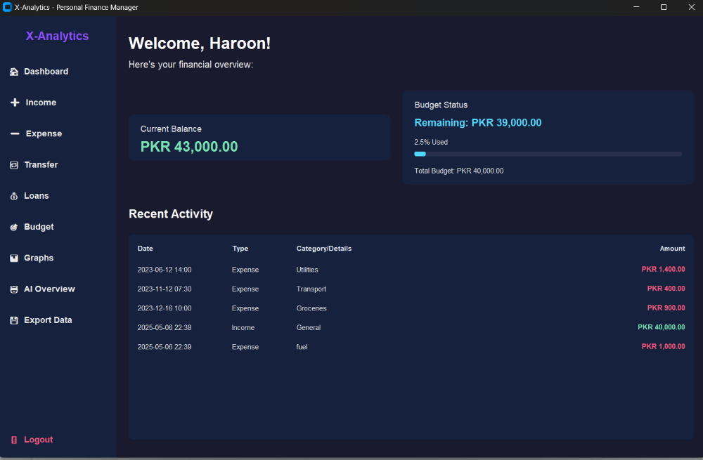

## Developed by Haroon

# 🧠 personal Finance Manager Application (Python)

This document describes the core logic and data handling components of the Personal Finance Manager application, primarily implemented in `logic.py`. This module is responsible for managing user accounts, processing financial transactions, handling budgets and loans, scheduling recurring expenses, and providing data analysis and prediction capabilities, independent of the graphical user interface.

## ✨ Functionalities

The `logic.py` module encapsulates the following key features:

### User and Account Management
- Creating new user accounts (`create_client`).
- Validating user credentials (`validate`).
- Representing different account types (e.g., `StandardAccount`, `ChildAccount`) with specific restrictions.
- Loading and saving the state of all user accounts to persistent storage (`load_all_clients`, `save_all_clients`).

### Transaction Processing
- Adding income (`add_income`).
- Recording expenses (`withdraw`), including budget checks.
- Handling fund transfers between accounts (`transfer`).
- Logging all transactions with timestamps, types, and categories (`log_transaction`).

### Loan and Budget Management
- Requesting loans (`request_loan`).
- Repaying loans (`repay_loan`).
- Setting and tracking monthly budgets (`set_budget`).

### Recurring Expenses
- Scheduling recurring expenses (`schedule_recurring`).
- Automatically processing overdue recurring transactions (`process_recurring`) upon user login or other triggers.

### Data Reporting and Analysis
- Generating a summary report of financial activity (`generate_report`).
- Creating visual charts (monthly net cash flow, expense breakdown) from transaction data (`plot_charts`).

### AI-Powered Prediction
- Predicting future cumulative expense trends using linear regression (`predict_future_expense_data`).
- Predicting the total expense for the next calendar month (`predict_next_month_expense`).

## 🛠 Libraries and Data Handling

The `logic.py` module leverages standard Python libraries and external packages for its operations:

- `csv`: Used for reading from and writing to the plain text data files (`users.txt` and `transactions.csv`).
- `datetime`, `timedelta`: For handling timestamps and calculating time differences, crucial for transaction logging and recurring expense processing.
- `abc` (Abstract Base Classes): Used to define a base `Client` class with abstract methods, providing a structure for different account types.
- `os`: For basic file system operations like checking file existence and renaming (for safer file saving).
- `pandas`: Extensively used for efficient data manipulation, reading CSV files, filtering, grouping, and time-series operations, particularly for reporting and prediction features.
- `matplotlib.pyplot`: Used for generating plots (monthly trend, expense pie chart, prediction graph).
- `sklearn.linear_model.LinearRegression`: The core component for the expense prediction functionality.
- `numpy`: Used in conjunction with scikit-learn for numerical operations, especially array manipulation for the linear regression model.

## 📂 Data Persistence

The logic layer manages data using two primary files:

- `users.txt`: Stores user account details (username, password, balance, budget, loans, recurring expenses). Each line represents a user, with fields separated by commas. Recurring expenses are stored in a custom string format.
- `transactions.csv`: Stores a log of all financial transactions across all users. Each row details a single transaction, including username, timestamp, amount, type (Income, Expense, Transfer, Loan, Recurring), and category/details.

Data is loaded from these files when the application starts and saved back to them whenever a significant change occurs (e.g., adding income/expense, transferring, setting budget, logging out).

## 🎯 Separation of Concerns

This `logic.py` file is designed to be the backend engine for the application. It contains the core business logic and data management capabilities. It is intentionally separated from the `GUI.py` file, which is solely responsible for the user interface presentation and interaction. The GUI calls functions and methods defined in `logic.py` to perform operations and retrieve data, ensuring a clean separation of concerns.

## ✨ Note on the User Interface (GUI)

While this README focuses on the backend logic, the project also includes a graphical user interface (`GUI.py`) to provide a user-friendly way to interact with the financial management system. It's worth noting that the development of the GUI was significantly aided by the use of AI tools.
